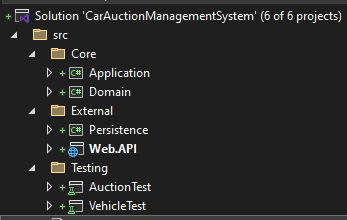
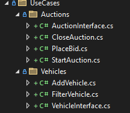
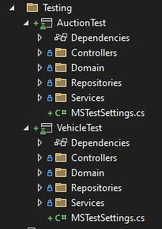

# Car Auction Management System

An API capable of managing car auctions.

## Design Assumptions

### Final Assumptions

    * an auction can only have one vehicle.
    * a vehicle can't have more than one auction.
    * an auction can't be opened after it has been closed.
    * an auction can't be closed if it's already closed.
    * an auction can't be created with state closed.
    * a bid can't be placed on closed auctions.
    * all auctions start with a bid of 0.
    * past bids on an auction are not relevant.

### Considered but not implemented:

    * toggle function instead of create and close auction 
    * auctions can be opened after they are closed
    * auctions are created when a vehicle is created, coupling the two objects.
    * auctions can have more than two status: Created, Open, Closed, Reopened, etc.
    * a dto for each car type was considered instead of creating a dto for each type of input request (ie, using the same dto for hatchback and sedan since their only property is shared (numberofdoors)). This was considered because in the future it was deemed more likely to add new cars rather than new properties to the existing cars.

## Design Decisions

### Architecture

A Clean Architecture approach was taken to design the solution. 

The Solution is devided into three package: Core, External, Testing.

Core is further devided into Domain and Application. 
- Domain contains the domain models and repository interfaces.
- Application contains Data Tranfer Objects (DTOs), errors, result objects and the services, which have been separated into Use Cases.

External is devided into Persistence and Web.API.
- Persistence contains the repository implementation.
- Web.API contains the endpoints and a GlobalExpectionHandler Middleware.

Testing into two solution, one for Auctions and another for vehicles.



### Dependencies

Swagger was used in the WEB.API layer.
MsTest was used in the tests.

#### Application

There were DTOs created for the Requests. It was decided to create a new DTO for every type of vehicle creation instead of using the same DTO for similiar objects. A possible improvement of the solution could be to change it so that only unique request DTOs are created.

The service layer is divided into specific use cases, in order to make the layer more maintainable and avoid a possible "God Service" class. 



The service class simply executes the useCases which themselves are injected via Dependency Injection.

Result and Error objects were created to handle possible errors. This was implemented in conjunction with a GlobalExpectionHandler. Result and Error objects are used when an error is expected and is thrown specifically in the repository and service layers, whereas Exceptions are thrown during model validations.

#### Web.API

Two controllers were created, one for vehicles and another for auctions. Each one of them calls the corresponding service and handles the response.

Responses are returned like so:
- A vehicle response:
     
     ```
     {
        "id": "160d8ae1-d62b-48e2-a2fb-89ed437f4c3c",
        "manufacturer": "Tesla",
        "model": "Super",
        "startingBid": 20000,
        "year": 2023,
        "type": "SUV"
    }   

    ```

- An auction response:

     ```
     {
        "vehicleId": "160d8ae1-d62b-48e2-a2fb-89ed437f4c3c",
        "currentBid": 0,
        "status": "OPEN"
    }  

    ```

A vehicle is created like so:

 
     ```
     {
        "$type": "SUV",
        "manufacturer": "Tesla",
        "model": "Super",
        "startingBid": 20000,
        "year": 2023,
        "numberOfSeats": 6
    }   

    ```

#### Testing

Tests were developed for every layer of the application and the solution is divided accordingly. As mentioned previously, MsTest was used to develop the tests.

